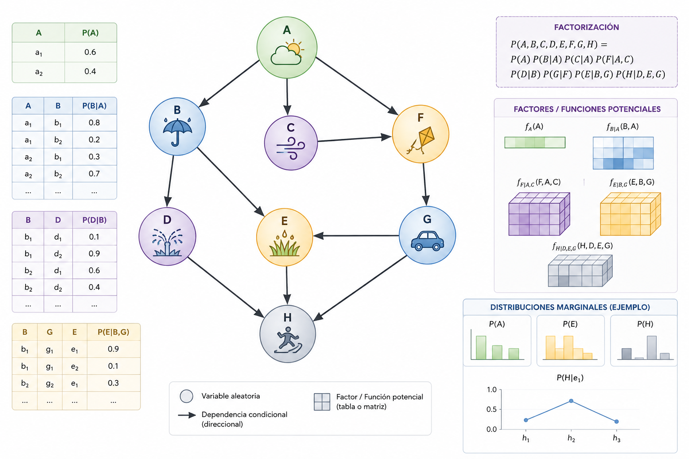

# Modelos gráficos probabilísticos

**Verano 2026** · Bienvenid@ 👋

---

Los **modelos gráficos probabilísticos** combinan teoría de grafos y probabilidad para representar y razonar bajo incertidumbre — una de las herramientas más poderosas en inteligencia artificial y estadística bayesiana.



---

::::{grid} 3
:::{grid-item-card} Representación
Construirás grafos que codifican dependencias entre variables de forma modular, transparente e independiente del algoritmo.
:::
:::{grid-item-card} Inferencia
Usarás algoritmos para responder preguntas concretas sobre el modelo sin necesidad de calcular distribuciones conjuntas completas.
:::
:::{grid-item-card} Aprendizaje
Estimarás parámetros y estructura directamente desde datos, combinando conocimiento experto con evidencia empírica.
:::
::::

```{admonition} ¿A quién va dirigido?
:class: tip
A estudiantes de posgrado con bases en **probabilidad**, **estadística** y **programación en Python** que quieran profundizar en razonamiento bajo incertidumbre aplicado a ciencia de datos e IA.
```

```{toctree}
:hidden:
:maxdepth: 1
:caption: Módulos y recursos

introduccion
acuerdos-de-clase
herramientas

modulo1/index
modulo2/index
modulo3/index

recursos-bibliograficos
```
