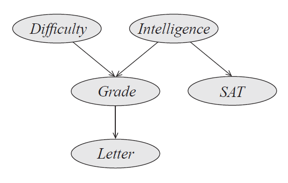

# Introducción

## ¿Qué son los Modelos gráficos probabilísticos?

No vamos a comenzar con una definición formal, sino que vamos a descomponer _<<Modelos gráficos probabilísticos>>_ en sus partes constitutivas.

Para comenzar, la **Figura 1** presenta de forma gráfica una síntesis de los conceptos fundamentales que subyacen al enfoque de los Modelos gráficos probabilísticos (MGP).


**Figura 1.** Componentes clave de los MGP. Este enfoque combina una representación declarativa (modelo), una estructura basada en grafos para modelar sistemas complejos (gráfico), y un marco formal para razonar e inferir bajo incertidumbre (probabilístico).

```{admonition} ¿A qué nos referimos con "Modelos"
:class: note

Un "modelo" es una _representación declarativa_ de nuestro entendimiento del mundo.

* Proponemos un modelo que captura _cómo entendemos las variables_ que describen un fenómeno y cómo interactúan entre sí.

* Que sea _declarativo_ significa que la representación se sostiene por sí misma. Esto quiere decir que podemos dar sentido al modelo _independientemente_ del _algoritmo_ que elijamos aplicar sobre él.
```

```{admonition} ¿A qué nos referimos con "Probabilísticos"?
:class: note

La palabra "probabilísticos" está presente porque nos ayuda a manejar la _incertidumbre_.

* La _teoría de la probabilidad_ es un marco formal que nos permite representar la _incertidumbre_ de forma coherente y cuantitativa.

* Podemos:
    - Razonar con nueva información --> _qué pasa si observamos algo nuevo?_

    - Tomar decisiones bajo incertidumbre --> _qué es lo mejor que podemos hacer?_

    - Aprender modelos desde los datos --> gracias a la conexión con la estadística, la probabilidad nos permite aplicar técnicas de aprendizaje automático estadístico para aprender los parámetros o la estructura de un modelo.
```

```{admonition} ¿A qué nos referimos con "Gráficos"?
:class: note

La palabra "gráficos" está presente porque nos ayuda a manejar la _complejidad_.

* Un grafo nos ayudará a representar sistemas complejos de forma modular y visual.

* Un grafo es una estructura matemática compuesta por nodos (o vértices) y aristas (o enlaces) que conectan pares de nodos. En el contexto de los MGP, los nodos representan variables aleatorias y las aristas representan dependencias probabilísticas entre estas variables.
```

Citando a Michael I. Jordan (1998):

> _Graphical models are a marriage between probability theory and graph theory. They provide a natural tool for dealing with two problems that occur throughout applied mathematics and engineering -- **uncertainty and complexity** -- and in particular they are playing an increasingly important role in the design and analysis of machine learning algorithms. Fundamental to the idea of a graphical model is the notion of **modularity** -- a complex system is built by combining simpler parts. Probability theory provides the glue whereby the parts are combined, ensuring that the system as a whole is consistent, and providing ways to interface models to data. The graph theoretic side of graphical models provides both an intuitively appealing interface by which humans can model highly-interacting sets of variables as well as a data structure that lends itself naturally to the design of efficient general-purpose algorithms._

> _Many of the classical multivariate probabalistic systems studied in fields such as statistics, systems engineering, information theory, pattern recognition and statistical mechanics are special cases of the general graphical model formalism -- examples include mixture models, factor analysis, hidden Markov models, Kalman filters and Ising models. The graphical model framework provides a way to view all of these systems as instances of a common underlying formalism. This view has many advantages -- in particular, specialized techniques that have been developed in one field can be transferred between research communities and exploited more widely. Moreover, the graphical model formalism provides a natural framework for the design of new systems."_

[Citado por Kevin Murphy, 1998.](https://www.cs.ubc.ca/%7Emurphyk/Bayes/bnintro.html) y cita original de Michael I. Jordan, 1998 en _Learning in Graphical Models_.

---

## Entonces...

**¿Por qué aprender un nuevo marco conceptual —y no solo otro modelo más— para el análisis en Machine Learning?**

Es el momento de conectar con el curso 💙 y descubrir el valor profundo de dominar este marco conceptual.

En ciencia de datos usamos todo tipo de modelos: redes neuronales, árboles de decisión, regresiones, random forests, etc. Entonces, **¿por qué dedicar un curso completo a los modelos gráficos probabilísticos?**

> Porque abordan _otro tipo de preguntas_ y _otro tipo de problemas_ que no son tan fáciles de resolver con los modelos tradicionales.

```{admonition} ¿qué hace únicos a los MGP?
:class: important

Los MGP **separan claramente el modelo del algoritmo**.

- **Formular distintas preguntas sobre el mismo modelo**:

  - Diagnóstico: $P(\text{Enfermedad} \mid \text{Síntomas})$
  - Predicción: $P(\text{Síntomas} \mid \text{Enfermedad})$
  - Completado de datos faltantes: $P(X_i \mid X_{-i})$
  - Detección de anomalías: ¿cuánto se desvía una observación del comportamiento esperado?

- **Elegir distintos algoritmos según necesidad**:

  - Inferencia exacta (si el modelo es pequeño)
  - Inferencia aproximada (si es grande o intractable)
  - Algoritmos más rápidos pero menos precisos, o más costosos pero más exactos.

- **Diseñar modelos más interpretables y modulares**.
```

En la mayoría de los modelos de machine learning, el **modelo** y el **algoritmo** vienen **"pegados"**: solo sirven para una tarea específica.

Pero en MGP, puedes _mantener el modelo fijo_ y _cambiar el algoritmo_ según la pregunta que quieras hacer.

> Eso es lo que los convierte no solo en una herramienta, sino en un **marco de razonamiento general bajo incertidumbre**.


**Figura 2.** El modelo como representación declarativa. Un modelo gráfico probabilístico puede construirse a partir de conocimiento experto (elicitación) o aprendido a partir de datos, y luego ser manipulado mediante distintos algoritmos según el tipo de pregunta o tarea. Esta separación entre modelo y algoritmo es una de las ventajas clave del enfoque. Inspirado en material del curso _Probabilistic Graphical Models 1: Representation_, impartido por Daphne Koller (Stanford University).

---

## Tres pilares de los MGP:

Según _Daphne Koller_ y _Nir Friedman_, los MGP se basan en tres pilares fundamentales:

> _“These three components — **representation, inference, and learning** — are critical components in constructing an intelligent system. We need a **declarative representation** that is a reasonable encoding of our world **model**. We need to be able to use this representation effectively to answer a broad range of **questions** that are of interest. And we need to be able to acquire this distribution, combining **expert knowledge** and **accumulated data**. Probabilistic graphical models are one of a small handful of frameworks that support all three capabilities for a broad range of problems.”_

### I. Representación

```{figure} ../source/images/nodo.png
:alt: representacion
:fig-align: center
:width: 200px

```

> Usar una estructura gráfica para capturar dependencias entre variables aleatorias.

- El _grafo_ hace explícita la estructura causal o condicional entre variables.

- Esta representación es declarativa y transparente, es decir:

  - Se puede inspeccionar.

  - Un humano puede interpretarla.

  - Se separa del algoritmo: podemos usar distintos algoritmos sobre el mismo modelo.

---

### II. Inferencia

```{figure} ../source/images/lupa.png
:alt: representacion
:fig-align: center
:width: 200px

```

> Aplicar _algoritmos de inferencia_ sobre el modelo para responder _preguntas_.

- Por ejemplo:

  - ¿Cuál es la probabilidad de que un paciente tenga gripe dado que tiene fiebre?

  - ¿Qué síntomas debo observar para reducir mi incertidumbre?

- Los algoritmos de inferencia usan la estructura gráfica para responder estas consultas eficientemente, sin necesidad de reconstruir toda la distribución conjunta.

- Pueden ser exactos _(variable elimination, belief propagation)_ o aproximados _(sampling, variational)_.

---

### III. Aprendizaje

```{figure} ../source/images/cerebro.png
:alt: representacion
:fig-align: center
:width: 200px

```

> Construir el modelo automáticamente a partir de datos históricos.

- Esto incluye:

  - Estimar parámetros (probabilidades condicionales).

  - Aprender la estructura del grafo.

- Se apoya en enfoques impulsados por datos (data-driven).

- Resultado: modelos que reflejan mejor el dominio real que los modelos construidos puramente a mano.

- Combinan conocimiento experto con información empírica.

---



_Figura 3._ Ejemplo de un modelo gráfico probabilístico.

Con lo visto hasta ahora, vamos a definir los objetivos del curso.

## Objetivo general

- Comprender los modelos gráficos probabilísticos y sus aplicaciones en el análisis de datos, la inferencia estadística y la toma de decisiones en entornos de incertidumbre mediante la construcción, análisis y aplicación de modelos como redes bayesianas y redes de Markov para modelar sistemas complejos y resolver problemas prácticos en diversas áreas.

### Objetivos particulares

- Modelar problemáticas/situaciones reales mediante grafos probabilísticos.

- Responder preguntas de interés práctico acerca de las problemáticas/situaciones modeladas usando algoritmos de inferencia.

- Estimar los parámetros y/o estructura de los modelos usando técnicas de optimización.

### Prerrequisitos

- Probabilidad y Estadística – 🎲
- Programación en Python – 🐍
- Optimización Convexa – 📈
- Análisis Estadístico Multivariado 📊

## Referencias

- Koller, D., & Friedman, N. (2009). Probabilistic Graphical Models: Principles and Techniques. MIT Press.

- Jordan, M. I. (1998). Learning in Graphical Models. _NATO Science Series D: Behavioural and Social Sciences_ vol. 89. Springer.
