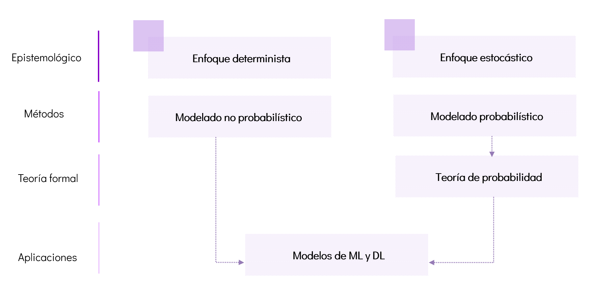
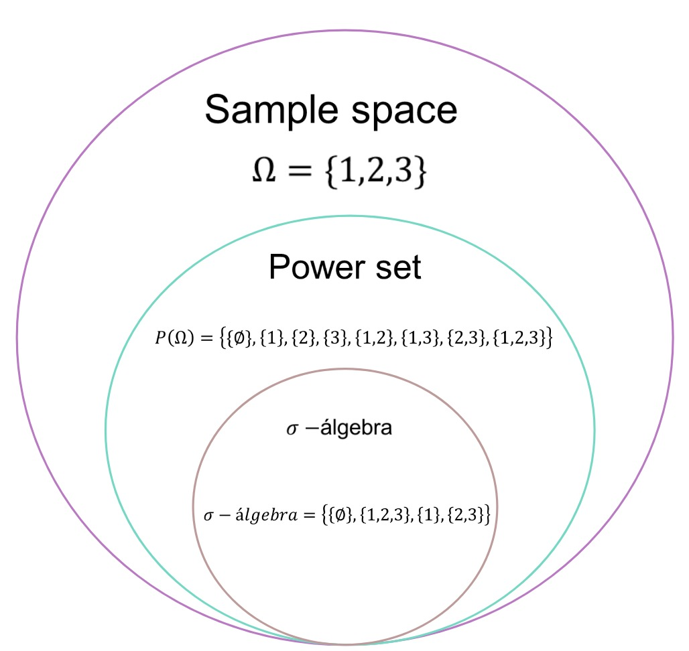
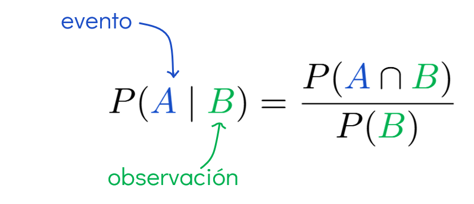
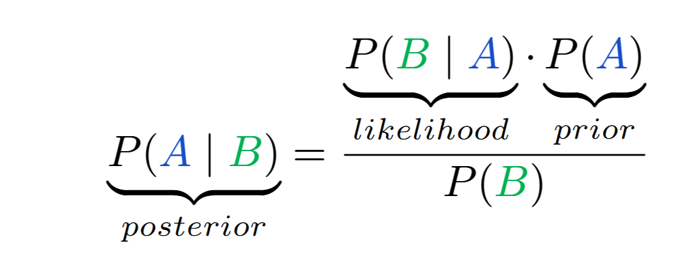
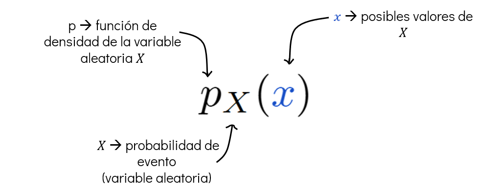
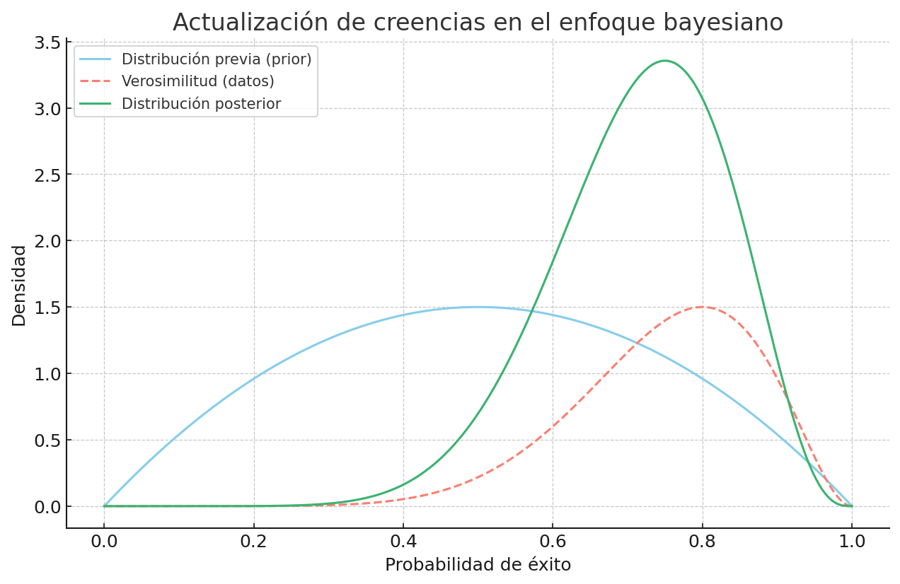
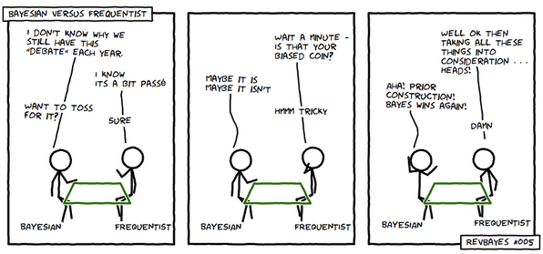

# Sesión 2

## 1. Repaso de probabilidad

### 1.1. Introducción

Antes de sumergirnos en el mundo de los _modelos gráficos probabilísticos_, comprendamos primero algunos de los fundamentos de la teoría de probabilidad, ya que constituye la base formal para este enfoque.

Una forma de visualizar su importancia es observando cómo diferentes perspectivas epistemológicas y metodológicas dan lugar a distintos tipos de modelado. En la **Figura 1**, se muestra una distinción entre dos enfoques principales:

- El **enfoque determinista**, que se basa en el modelado no probabilísta y utiliza métodos donde no interviene el azar.

- El **enfoque estocástico**, que recurre al modelado probabilísta y se sustenta formalmente en la teoría de probabilidad.

Ambos caminos convergen en aplicaciones prácticas como los **modelos de aprendizaje automático (ML) y aprendizaje profundo (DL)**. Estos modelos pueden surgir tanto desde una perspectiva determinista como estocástica, aunque es en el enfoque probabilístico donde encontramos herramientas más directas para representar la _incertidumbre_ y tomas decisiones informadas.



**Figura 1.** Elaboración propia.

### 1.2. Fundamentos de la teoría de probabilidad

La teoría de probabilidad nos permite modelar incertidumbre mediante una estructura matemática compuesta por tres elementos: _un espacio muestral $\Omega$, un sistema de eventos medibles $S$ y una función de probabilidad $\mathbb{P}$_. Formalmente, esta estructura se expresa como la **triple**:

$$(\Omega, S, \mathbb{P})$$

---

A continuación, desglosamos cada uno de estos componentes:

#### 1.2.1. Espacio muestral $(\Omega)$

El **espacio muestral** es el conjunto que contiene **todos los posibles resultados** de un experimento aleatorio. Se denota por:

$$
\Omega
$$

- Representa **todo lo que puede pasar**.

- Es el punto de partida para definir eventos.

```{admonition} Ejemplo
:class: tip

Si lanzamos un dado de 6 caras, el espacio muestral es:

$\Omega = \{1, 2, 3, 4, 5, 6\}$
```

Puedes consultar más [aquí](https://en.wikipedia.org/wiki/Probability_space)

#### 1.2.2. Conjunto potencia $\mathcal{P}(\Omega)$

Es el conjunto de **todos los subconjuntos _posibles_** de $\Omega$.

- Incluye desde el conjunto vacío $\varnothing$ hasta el conjunto total $\Omega$.

- Representa **todas las _combinaciones_ posibles de eventos.**

```{admonition} Ejemplo
:class: tip

Si $\Omega={1,2,3}$, entonces:

$P(\Omega) = \{\varnothing, \{1\}, \{2\}, \{3\}, \{1,2\}, \{1,3\}, \{2,3\}, \{1,2,3\}\}$
```

A continuación, podemos ver el **conjunto potencia** en la **Figura 2**, representado mediante un diagrama de Hasse.


**Figura 2.** Diagrama de Hasse del conjunto potencia de ${1,2,3}$. Elaboración propia con base en: [_Power set_](https://en.wikipedia.org/wiki/Power_set).

Puedes consultar más [aquí](https://en.wikipedia.org/wiki/Power_set).

#### 1.2.3. σ-álgebra $(S)$ o espacio de eventos

Es una colección especial de subconjuntos de $\Omega$ (es decir, una subcolección de $\mathcal{P}(\Omega)$) que cumple con tres propiedades clave:

```{admonition} Propiedades del sistema de eventos $S$
:class: tip

1. **Contiene el evento vacío y el evento total**
   - $\varnothing \in S$: representa el evento que nunca ocurre.
   - $\Omega \in S$: representa el evento que siempre ocurre.

2. **Cerrado bajo unión**
   Si $\alpha, \beta \in S$, entonces $\alpha \cup \beta \in S$.
   Esto permite formar eventos como “ocurre $\alpha$ o $\beta$”.

3. **Cerrado bajo complemento**
   Si $\alpha \in S$, entonces $\Omega - \alpha \in S$ (también denotado $\alpha^c$).
   Esto garantiza que también podamos trabajar con el evento “no ocurre $\alpha$”.
```

```{admonition} Ejemplo
Si $\Omega={1,2,3}$, una posible σ-álgebra es:

$$S = \{\varnothing, \{1,2,3\}, \{1\}, \{2,3\}\}$$

Aquí, $\{2,3\}$ es el complemento de $\{1\}$, y viceversa.
```

Puedes consultar más [aquí](https://en.wikipedia.org/wiki/%CE%A3-algebra#Definition_and_properties).

#### 1.2.4. Función de probabilidad

Hasta ahora hemos definido el espacio muestral $(\Omega)$, que contiene todos los posibles resultados de un experimento, y una σ-álgebra $(S)$, que representa los subconjuntos medibles de $(\Omega)$, es decir, los **eventos** a los que podemos asignar una probabilidad coherente.

Una **función de probabilidad** es una regla matemática que asigna a cada evento medible un número entre $0$ y $1$, representando **cuán probable** es que ese evento ocurra. Formalmente:

$$\mathbb{P} : S \rightarrow [0, 1]$$

o

$$0 \leq \mathbb{P}(\text{evento}) \leq 1$$

Para que esta asignación tenga sentido y sea consistente con la intuición, la función $\mathbb{P}$ debe cumplir tres condiciones fundamentales, conocidas como los **axiomas de Kolmogórov**:

```{admonition} Definición formal
:class: tip

Una función $\mathbb{P}$ es una **probabilidad** sobre el espacio $(\Omega, S)$ si cumple:

1. **No negatividad:** $\mathbb{P}(A) \geq 0$ para todo $A \in S$

2. **Normalización:** $\mathbb{P}(\Omega) = 1$

3. **Aditividad numerable:** si tienes una **colección infinita de eventos** $(A_1, A_2, A_3, \ldots)$ que son **mutuamente excluyentes** (es decir, no se superponen, o sea, $(A_i \cap A_j = \emptyset)$ si $( i \ne j )$), entonces la probabilidad de que ocurra alguno de esos eventos (la unión de todos ellos) es igual a la **suma de las probabilidades individuales**.

$$
\mathbb{P}\left( \bigcup_{i=1}^{\infty} A_i \right) = \sum_{i=1}^{\infty} \mathbb{P}(A_i)
$$

Esto garantiza que la probabilidad se comporta de manera coherente incluso cuando se trata de **infinitas situaciones posibles**, no solo finitas. Es una característica esencial para que una función se considere una **medida de probabilidad** en _teoría de la medida_.
```

> 📌 _Nota:_ Estos tres principios consolidan la probabilidad como una rama formal de la matemática, basada en la _teoría de conjuntos_ y la _teoría de la medida_.

```{admonition} Evento en teoría de probabilidad
:class: tip

En teoría de probabilidad, un **evento** es cualquier subconjunto del espacio muestral $\Omega$ que **pertenece a la σ-álgebra** $(S)$.
Solo a estos eventos se les puede asignar una probabilidad formalmente válida.
Por eso también se les llama **eventos medibles**.
```

##### ¿Cómo se relacionan los conceptos que hemos visto?

Para construir un modelo probabilístico sólido, necesitamos entender cómo se relacionan tres objetos fundamentales: el **espacio muestral**, el **conjunto potencia** y la **σ-álgebra**.

- El **espacio muestral** $\Omega$ es el punto de partida: contiene todos los posibles resultados de un experimento.

- A partir de él, podemos formar el **conjunto potencia** $\mathcal{P}(\Omega)$, que incluye **todos los subconjuntos posibles** de $\Omega$. En principio, cada uno de estos subconjuntos podría considerarse un evento.

- Sin embargo, no todos los subconjuntos de $\Omega$ pueden ser tratados como **eventos válidos** desde el punto de vista de la probabilidad. Para que un subconjunto sea un **evento medible**, debe pertenecer a una **σ-álgebra** $S \subseteq \mathcal{P}(\Omega)$, la cual cumple ciertas propiedades de consistencia lógica (como estar cerrada bajo unión, complemento, etc.).

Podemos resumir estas diferencias clave en la siguiente tabla:

| Concepto                                | Qué representa                                | Contenido                                    |
| --------------------------------------- | --------------------------------------------- | -------------------------------------------- |
| Espacio muestral $(\Omega)$             | Resultados posibles de un experimento         | Un conjunto base (como $\{1,2,3\})$          |
| Conjunto potencia $\mathcal{P}(\Omega)$ | Todos los subconjuntos posibles de $(\Omega)$ | Todos los eventos posibles, medibles o no    |
| $\sigma$-álgebra $(S)$                  | Subconjuntos **medibles** de $(\Omega)$       | Subconjuntos que cumplen ciertas propiedades |

---

La siguiente **Figura 2** ilustra visualmente cómo se relacionan estos tres niveles de generalidad:



**Figura 2.** Relación entre espacio muestral, conjunto potencia y $\sigma$-álgebra. Elaboración propia.

#### 1.2.5. Distribución de probabilidad

Una vez definida la función de probabilidad $\mathbb{P}$, podemos describir **cómo se reparte esa probabilidad** entre los posibles resultados de un experimento. A esto lo llamamos **distribución de probabilidad**.

Dependiendo del tipo de espacio muestral, la distribución puede tomar dos formas principales:

---

##### 1.2.5.1 Distribuciones discretas


Este tipo de distribución se utiliza cuando el _espacio muestral_ $\Omega$ es **finito o numerable** (como lanzar un dado o una moneda).

Asignan una probabilidad explícita a cada valor individual de la variable aleatoria:

$$
\mathbb{P}(X = x_i) = p_i \quad \text{con } \sum_i p_i = 1
$$

```{admonition} Ejemplo
:class: tip

Supongamos que lanzamos un dado justo.
Entonces $\Omega = \{1, 2, 3, 4, 5, 6\}$ y usamos $\mathcal{P}(\Omega)$ como $\sigma$-álgebra.

Definimos la probabilidad como:

$$
\mathbb{P}(\{i\}) = \frac{1}{6} \quad \text{para } i = 1,\dots,6
$$

Así, por ejemplo:
- $\mathbb{P}(\{2,4,6\}) = \frac{3}{6} = 0.5$
- $\mathbb{P}(\{1\}) = \frac{1}{6}$
```

---

##### 1.2.5.1 Distribuciones continuas


Se definen sobre espacios infinitos (por ejemplo, $\mathbb{R}$).
No asignan probabilidad a valores individuales, sino a intervalos, mediante una función de densidad $f(x)$:

$$
\mathbb{P}(a \leq X \leq b) = \int_a^b f(x)\, dx
$$

```{admonition} Ejemplo
:class: tip

La distribución normal (o gaussiana) tiene densidad:

$$
f(x) = \frac{1}{\sqrt{2\pi}} e^{-x^2/2}
$$

Y cumple:

- $f(x) \geq 0$ para todo $x$
- $\int_{-\infty}^{\infty} f(x) \, dx = 1$

💡 *Nota:* $f(x)$ no representa una probabilidad directa, sino una **densidad**:
la probabilidad de que $X$ tome un valor exacto (como $X = 0$) es **0**. Solo intervalos tienen probabilidad positiva.
```

```{admonition} Nota
:class: note

Las _distribuciones de probabilidad_ resumen toda la información necesaria para calcular eventos como:
$\mathbb{P}(X \in A)$, para cualquier conjunto medible $A \in S$.

- En el caso **continuo**, esto se hace mediante **integrales** sobre funciones de densidad.
- En el caso **discreto**, mediante **sumas** de probabilidades individuales.
```

> 📌 _Nota:_ Puedes explorar gráficamente las diferentes distribuciones en [este recurso.](https://seeing-theory.brown.edu/probability-distributions/index.html#section1)

#### 1.2.6. Interpretaciones de la probabilidad

Ya sabemos qué es una _función de probabilidad_ y cómo puede _distribuirse_ sobre un espacio muestral. Es importante notar que, en este punto, la _probabilidad_ es un objeto estrictamente matemático, cuya definición está separada del proceso mediante el cual se asignan probabilidades a los eventos.

Pero surge una pregunta fundamental:

> **¿Cómo se asignan o calculan esos valores de probabilidad en la práctica?**

La respuesta depende de la **interpretación** que adoptemos sobre qué representa una probabilidad en un contexto real.

A continuación, exploramos dos de las interpretaciones más influyentes y ampliamente utilizadas: la **frecuentista** y la **bayesiana**.

##### Enfoque frecuentista: medir por repetición

> Si repetimos un experimento muchas veces, el cociente entre el número de veces que ocurre un evento y el total de repeticiones se usa como una estimación de su probabilidad. Este valor es lo que se conoce como la _frecuencia relativa_.

Este valor se llama _frecuencia relativa_ del evento:

$$\mathbb{P}(A) \approx \frac{\#A}{n}$$

A medida que el número de experimentos crece, esta frecuencia relativa tiende (bajo ciertas condiciones) a estabilizarse en un valor fijo. Este valor es interpretado como la **probabilidad** del evento desde el punto de vista _frecuentista_.

```{admonition} Frecuencia relativa
:class: attention

La **frecuencia relativa** es el cociente entre el número de veces que ocurre un evento y el número total de repeticiones del experimento. En el enfoque **frecuentista**, esta proporción se interpreta como la probabilidad del evento, especialmente cuando el número de repeticiones es grande.
```

```{admonition} Ejemplo
:class: tip


Si lanzamos una moneda 1000 veces y cae cara en 502 de ellas, entonces:

$$
\mathbb{P}(\text{cara}) \approx \frac{502}{1000} = 0.502
$$

Al aumentar el número de repeticiones, esta estimación se estabiliza. Podemos observar este fenómeno en la **Figura 3.**
```


**Figura 3**. En el enfoque frecuentista, la probabilidad se interpreta como el valor al que tiende la _frecuencia relativa_ de un evento (por ejemplo, "cara" en una moneda) conforme se incrementa el número de repeticiones del experimento.

```{admonition} ¿Es sólo una fórmula?
:class: caution

Aunque el enfoque frecuentista utiliza la _frecuencia relativa_ para estimar la probabilidad, **no se reduce solamente a una fórmula**.

Este enfoque implica una forma específica de entender qué es una probabilidad:

1. La probabilidad de un evento se **define** como el **límite** de su _frecuencia relativa_ al repetir el experimento muchas veces.

$$\lim_{n \to \infty} \frac{\#A}{n} = \mathbb{P}(A)$$

2. Se asume que las probabilidades son **propiedades objetivas del mundo**, no creencias subjetivas.
3. No se habla de probabilidades en eventos únicos o no repetibles, como “la probabilidad de que llueva mañana”.

Por tanto, el frecuentismo es una postura **matemática y filosófica**, no solo un método de cálculo.
```

> **¿Qué significa "variable aleatoria" en estadística frecuentista?**

Hasta ahora, posiblemente has visto que una _variable aleatoria_ es algo que usamos para modelar resultados inciertos, como lanzar un dado, medir una altura, o contar cuántas veces sale cara una moneda.

Y eso es, precisamente, lo que significa en el enfoque **frecuentista**.

> Una _variable aleatoria_ representa el **resultado numérico** de un experimento aleatorio que se puede repetir muchas veces.

Por ejemplo, si lanzas una moneda y defines $(X = 1)$ si sale cara y $(X = 0)$ si sale cruz, entonces $(X)$ es una _variable aleatoria_.

Aquí, lo aleatorio es el **resultado** del experimento, **no** el parámetro que describe su comportamiento (como la probabilidad de que salga cara).

Desde esta perspectiva, _los parámetros son constantes fijas, pero desconocidas_ y no se modelan con variables aleatorias.

```{admonition} Fundamento teórico
:class: note

El hecho de que la frecuencia relativa se estabilice a medida que aumenta el número de repeticiones está respaldado por un resultado matemático conocido como la [**ley de los grandes números**](https://es.wikipedia.org/wiki/Ley_de_los_grandes_n%C3%BAmeros).
```

##### Enfoque bayesiano: probabilidades como creencias

_¿Qué significa decir que algo tiene cierta probabilidad de ocurrir desde la perspectiva bayesiana?_

El enfoque bayesiano propone una forma muy intuitiva de verlo:

> La probabilidad es una medida de qué tanto creemos que algo es cierto, basándonos en lo que sabemos hasta ahora.

Así, para los bayesianos, la probabilidad no es una propiedad fija del mundo como “la gravedad”, sino más bien una forma de representar nuestra incertidumbre. Y lo más importante:

> 💡 Esa creencia puede cambiar si recibimos nueva información.

```{admonition} Ejemplo
Supón que alguien te dice:

> _"Hay probabilidad de lluvia mañana"._

Esa probabilidad puede ser diferente dependiento de si:

* viste un pronóstico confiable,

* el cielo está completamente despejado,

* o escuchaste truenos a lo lejos.

Cada nueva pista _cambia tu creencia_. Y esto es justamente lo que el enfoque bayesiano busca formalizar: **cómo actualizamos** nuestras creencias cuando obtenemos nueva evidencia.
```

> ¿Cómo se hace esto?

La herramienta central para actualizar nuestras creencias es la **probabilidad condicional**:

$$
\mathbb{P}(A \mid B) = \frac{\mathbb{P}(A \cap B)}{\mathbb{P}(B)}
$$

Esta fórmula expresa la probabilidad de que ocurra un evento $(A)$, dado que se ha observado otro evento $(B)$. La **probabilidad condicional** es el primer paso hacia un modelo bayesiano completo, ya que introduce la noción de **información que modifica creencias**.

```{admonition} Probabilidad condicional
:class: tip

La probabilidad condicional nos dice cuál es la probabilidad de que ocurra un evento $(A)$, dado que ya sabemos que ha ocurrido otro evento $(B)$.



Por ejemplo, la probabilidad de lluvia puede cambiar si sabemos que el cielo está despejado. Esta forma de actualizar creencias es esencial en el enfoque **bayesiano**.
```

Aquí es donde entra en escena el famoso **Teorema de Bayes**.

```{admonition} Teorema de Bayes: actualización de creencias
:class: important

El Teorema de Bayes permite **actualizar una creencia previa** cuando se incorpora nueva información. Se compone de tres elementos:

- **Prior**: lo que creíamos antes de observar datos $(P(A))$
- **Likelihood** (verosimilitud): qué tan probable es observar los datos si la hipótesis fuera cierta $(P(B \mid A))$
- **Posterior**: lo que creemos **después** de observar los datos $(P(A \mid B))$



Este resultado es matemáticamente demostrable, y es la base de toda la estadística bayesiana.
```

> **¿Qué significa "variable aleatoria" en estadística bayesiana??**

Hasta ahora, posiblemente has visto que una variable aleatoria es algo que usamos para modelar resultados inciertos, como lanzar un dado, medir una altura, o contar cuántas veces sale cara una moneda.

Pero en el mundo bayesiano, las cosas se vuelven más interesantes:

> También usamos variables aleatorias para representar lo que no sabemos sobre un parámetro.

Por ejemplo, imagina que estás tratando de averiguar cuál es la probabilidad $\theta$ de que una máquina falle en un día cualquiera.
No tienes un número exacto, pero...

> _Creo que la máquina es bastante confiable, así que probablemente $\theta$ sea algo así como 0.1... pero no estoy segura"_

Aquí no estás hablando de un resultado aleatorio, como el lanzamiento de un dado. Estás hablando de tu **incertidumbre sobre un valor desconocido.**

Y eso, en bayes, se modela con una _variable aleatoria._

> **¿Y cómo describimos esa incertidumbre?**

Usamos lo que se llama una **distribución de probabilidad**, que nos dice qué tan probable o creíble creemos que es cada posible valor de $\theta$.

Por ejemplo:

- Si pensamos que valores pequeños de $\theta$ (como 0.05 o 0.1) son más probables, la distribución será más alta en esa zona.

- Si valores como 0.8 o 0.9 nos parecen muy poco probables, la distribución será muy baja allí.

Esto se representa con una función como:

$$
p_X(x)
$$

significa que:

- $(X)$: es la variable aleatoria que representa la probabilidad de un evento (como que salga cara).
- $(x)$: es un valor posible de esa probabilidad (por ejemplo, 0.7).
- $(p_X(x))$: es cuán creíble o probable consideramos ese valor, dada la información disponible.



**Figura 4.** Notación de la función de densidad de probabilidad: $p_X(x)$ represeta cuán probable o creíble creemos que es cada posible valor del parámetro X.

En lugar de afirmar “la probabilidad es 0.7”, el bayesiano dice: “0.7 es plausible, pero también lo son otros valores cercanos y esta es la distribución que los describe”.



**Figura 5.** En el enfoque bayesiano, una creencia inicial (distribución prior, línea azul) se combina con la evidencia aportada por los datos (verosimilitud, línea roja) para producir una creencia actualizada (posterior, línea verde). Esto se realiza aplicando el Teorema de Bayes.

```{admonition} Resumen
:class: tip

En estadística bayesiana:
- Los parámetros desconocidos se tratan como variables aleatorias.

- Modelamos nuestras creencias sobre esos valores con distribuciones de probabilidad.

- Cuando obtenemos nuevos datos, actualizamos esas creencias usando el Teorema de Bayes.
```

<iframe width="650" height="315"
    src="https://www.youtube.com/embed/XIbL0foEckA"
    title="YouTube video player"
    frameborder="0"
    allow="accelerometer; autoplay; clipboard-write; encrypted-media; gyroscope; picture-in-picture"
    allowfullscreen>
</iframe>

---



---

Una vez que entendemos qué representa una probabilidad y cómo se puede interpretar, el siguiente paso natural es analizar **cómo se combinan o se relacionan distintos eventos entre sí**.

Esto nos lleva a estudiar conceptos fundamentales como la **probabilidad condicional, conjunta y marginal**.

#### 1.2.7. Probabilidad conjunta, condicional y marginal

Hasta ahora hemos aprendido a:

- Definir un **espacio muestral** $(\Omega)$, que contiene todos los posibles resultados de un experimento.
- Considerar subconjuntos de $(\Omega)$ como **eventos**, organizados en una estructura llamada $(\sigma)$-álgebra.
- Asignar valores de **probabilidad** a esos eventos mediante funciones que cumplen ciertos principios (como los axiomas de Kolmogórov).
- Interpretar esos valores bajo los enfoques **frecuentista** y **bayesiano**.

Este marco nos permite describir eventos **individuales**, pero también **eventos compuestos**: por ejemplo, cuando dos condiciones ocurren a la vez, o una depende de otra.

---

##### ¿Qué nos permite considerar eventos compuestos?

La clave está en la $(\sigma)$-álgebra:

> Al definir el espacio de eventos como una $(\sigma)$-álgebra, garantizamos que podemos operar con ellos de forma lógica y estructurada:
>
> - unir eventos $(A \cup B)$
> - tomar complementos $(A^c)$
> - y también **intersecciones** como $(A \cap B)$, que representan **eventos conjuntos**.

Esto no solo nos permite construir descripciones más ricas de situaciones, sino que nos habilita a hacer **operaciones de probabilidad** sobre múltiples eventos.

A continuación, exploraremos tres operaciones fundamentales:

---

##### 1. Probabilidad conjunta

La **probabilidad conjunta** mide la probabilidad de que **dos eventos ocurran al mismo tiempo**.

Se denota como:

$$
\mathbb{P}(A \cap B)
$$

o, si el contexto lo permite, simplemente $\mathbb{P}(A, B)$.

```{admonition} Ejemplo
:class: tip

Si $(A = \{\text{llover}\})$ y $(B = \{\text{llevar paraguas}\})$,
entonces $(\mathbb{P}(A \cap B))$ representa la probabilidad de que **llueva y lleves paraguas** el mismo día.
```

##### 2. Probabilidad condicional

La **probabilidad condicional** responde a la pregunta:

> ¿Cuál es la probabilidad de que ocurra \(A\) si ya sabemos que ocurrió \(B\)?

Se define como:

$$
\mathbb{P}(A \mid B) = \frac{\mathbb{P}(A \cap B)}{\mathbb{P}(B)} \quad \text{si } \mathbb{P}(B) > 0
$$

```{admonition} Ejemplo
:class: tip

Si $(\mathbb{P}(\text{llover y llevar paraguas}) = 0.3 )$
y $(\mathbb{P}(\text{llevar paraguas}) = 0.5)$,
entonces:

$$
\mathbb{P}(\text{llover} \mid \text{llevar paraguas}) = \frac{0.3}{0.5} = 0.6
$$
```

##### 3. Probabilidad marginal

La **probabilidad marginal** es la probabilidad de un evento **sin condicionar** en ningún otro.

Cuando trabajamos con variables múltiples, podemos obtener la marginal de una variable “resumiendo” la información sobre las otras.

$$
\mathbb{P}(A) = \sum_{b} \mathbb{P}(A, B=b)
$$

En el caso continuo:

$$
\mathbb{P}(A) = \int \mathbb{P}(A, B)\, dB
$$

```{admonition} Nota
:class: note

La marginal es útil cuando queremos concentrarnos en un solo evento o variable, ignorando otras que también están en juego.
```

#### 1.2.8. Reglas derivadas de la probabilidad

Una vez que hemos definido formalmente la **probabilidad condicional**, podemos deducir tres reglas fundamentales que se utilizan constantemente en modelado probabilístico.

Estas reglas no son nuevos axiomas, sino **consecuencias directas** de combinar:

- Los **axiomas de Kolmogórov**, especialmente:

  - La aditividad: $P(A \cup B) = P(A) + P(B)$ si $A \cap B = \varnothing$

- La **definición de probabilidad condicional**

Veamos cada una:

##### 📌 Regla de marginalización

Se basa en la **aditividad**: si $B$ puede tomar varios valores disjuntos, entonces:

$$
P(A) = \sum_B P(A, B)
$$

Esta regla permite **reducir** una probabilidad conjunta a una **marginal**.

---

##### 📌 Regla de la cadena

Viene directamente de _reordenar_ la definición de probabilidad condicional:

$$
P(A \mid B) = \frac{P(A, B)}{P(B)} \quad \Rightarrow \quad P(A, B) = P(A \mid B) \cdot P(B)
$$

Esta relación es fundamental en estructuras secuenciales como los modelos gráficos.

También puede escribirse simétricamente:

$$
P(B, A) = P(B \mid A) \cdot P(A)
$$

---

##### 📌 Regla de la probabilidad total

Surge al aplicar **marginalización** sobre la **regla de la cadena**:

$$
P(A) = \sum_B P(A, B) = \sum_B P(A \mid B) \cdot P(B)
$$

Es decir, descomponemos la probabilidad de $A$ en función de sus componentes condicionales respecto a $B$.

```{admonition} Nota técnica
:class: tip

En el contexto de probabilidad, usamos la notación $P(A, B)$ como abreviatura de $P(A \cap B)$ (la probabilidad de que ocurran ambos eventos).
```

> Además de ser útil para calcular probabilidades marginales,  
> la **regla de la probabilidad total** también puede interpretarse como una **constante de normalización**:
>
> garantiza que la distribución condicional resultante \( P(A \mid B) \) sea **válida**,  
> es decir, que **sume 1** al considerar todos los posibles valores de \(A\).

```{math}
\sum_A P(A \mid B) = 1
```


**Figura 5.** La definición de probabilidad condicional permite derivar tres reglas fundamentales: la **regla de la cadena**, la **regla de marginalización** y la **regla de la probabilidad total**. Estas relaciones son la base del razonamiento probabilístico en contextos donde intervienen múltiples eventos.

#### 1.2.9. Independencia

Uno de los conceptos más importantes en teoría de probabilidad es el de **independencia entre eventos o variables**. Intuitivamente, dos eventos son independientes si el conocimiento de uno **no cambia** la probabilidad del otro.

> La independencia **no se asume** ni se deduce por intuición: **se verifica formalmente**.

```{admonition} Definición formal
:class: tip

Dos eventos $A$ y $B$ son independientes si:

$$
\mathbb{P}(A \mid B) = \mathbb{P}(A)
\quad \text{o equivalentemente} \quad
\mathbb{P}(A \cap B) = \mathbb{P}(A) \cdot \mathbb{P}(B)
$$

Esta última igualdad es más comúnmente usada, ya que no requiere el cálculo de probabilidades condicionales (evita divisiones por cero cuando $\mathbb{P}(B) = 0$).
```

##### Simetría

Una propiedad importante de la independencia es que **es simétrica**:

Si $A$ es independiente de $B$, entonces $B$ es independiente de $A$.

##### Alternativa para variables

Dos variables aleatorias $X$ y $Y$ son independientes si:

$$
\mathbb{P}(X = x, Y = y) = \mathbb{P}(X = x) \cdot \mathbb{P}(Y = y)
\quad \text{para todo } x, y
$$

```{admotion} Nota
:class: note

**¿Cómo lo verificamos?**

- Si las variables son **discretas**:
  Verifica la igualdad para **todas las combinaciones posibles** de valores.

- Si son **continuas**:
  Verifica si la densidad conjunta se puede escribir como el **producto de densidades marginales**.
```

> 📌 _Nota:_ basta con que una sola combinación no cumpla la igualdad para que las variables no sean independientes.

```{admonition} Ejemplo
:class: tip

Supón que lanzamos dos monedas. Sea $\alpha$: _“la primera moneda resulta en cara”_, y $\beta$: _“la segunda moneda resulta en cara”_. Estos eventos son independientes: saber que uno ocurrió no afecta la probabilidad del otro.

También en procesos más abstractos, la independencia puede surgir de la estructura del experimento. Por ejemplo:

- $\alpha$: _"el resultado del dado es par"_
- $\beta$: _"el resultado es 1 o 2"_

Si el dado es justo, es fácil verificar que:

$$
\mathbb{P}(\alpha \cap \beta) = \mathbb{P}(\alpha) \cdot \mathbb{P}(\beta) = \frac{1}{2} \cdot \frac{1}{3} = \frac{1}{6}
$$

Por lo tanto, $\alpha$ y $\beta$ son eventos independientes.
```

#### 1.2.10. Independencia condicional

La **independencia** es una propiedad útil, pero poco común en problemas reales:  
en la práctica, es raro que dos variables o eventos sean verdaderamente independientes.

Sin embargo, lo que sí ocurre con frecuencia es que **dos variables sean independientes _condicionalmente_** a una tercera.  
Es decir:

> **Dado que sabemos algo**, esa información “explica” o “desvincula” a las otras dos variables.

```{admonition} Definición formal
:class: tip

Decimos que $A$ y $B$ son **condicionalmente independientes dado $X$**, si se cumple:

$$
\mathbb{P}(A, B \mid X) = \mathbb{P}(A \mid X) \cdot \mathbb{P}(B \mid X)
$$

Lo cual también implica que:

$$
\mathbb{P}(A \mid B, X) = \mathbb{P}(A \mid X)
\quad \text{y} \quad
\mathbb{P}(B \mid A, X) = \mathbb{P}(B \mid X)
$$
```

> 📌 _Nota:_ La información de $X$ “bloquea” la dependencia entre $A$ y $B$.  
> Es decir, **una vez que sabemos $X$**, las otras dos variables > **no se influyen entre sí**.

```{admonition} Ejemplo
:class: tip

Supón que queremos estimar la probabilidad de que una estudiante sea admitida a un posgrado en el ITAM o en el CINVESTAV.

- Sea $I$: _"fue admitida al posgrado del ITAM"_
- Sea $C$: _"fue admitida al posgrado del CINVESTAV"_

Normalmente, $I$ y $C$ **no son independientes**: saber que fue admitida al ITAM probablemente aumenta nuestra creencia de que también será admitida al CINVESTAV, porque sugiere que es una estudiante sobresaliente.

Ahora supongamos que sabemos que su promedio de licenciatura ($G$) es de 9.5, y que ambas instituciones **basan su admisión únicamente en el promedio**.

Entonces, **dado $G = 9.5$**, los eventos $I$ y $C$ sí son independientes:

$$
\mathbb{P}(C \mid I, G) = \mathbb{P}(C \mid G)
$$

En este caso, decimos que **$C$ es condicionalmente independiente de $I$ dado $G$**.
```

```{admonition} Tip
Diremos que $A \perp B \mid C$ si se cumple:

$$
\mathbb{P}(A \cap B \mid C) = \mathbb{P}(A \mid C) \cdot \mathbb{P}(B \mid C)
$$
```

```{admonition} Notación común

$A \perp B \mid C$:
A es independiente de B dado C.

También se puede escribir:
$\mathbb{P}(A \mid B, C) = \mathbb{P}(A \mid C)$
```
