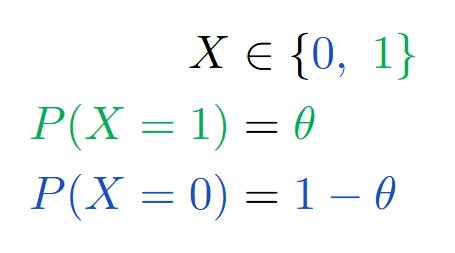
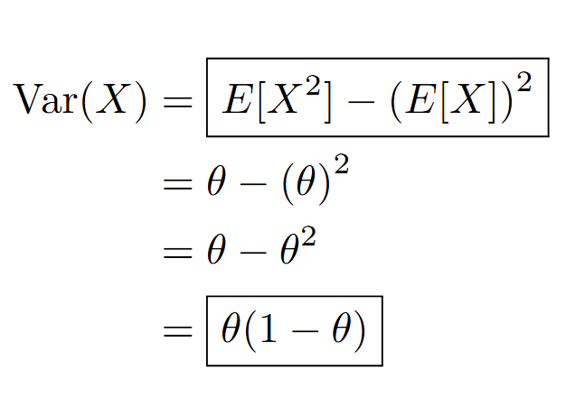

# Sesión 3

## 1. Repaso de probabilidad

### 1.1. Variables aleatorias discretas

```{admonition} Definición
:class: note

Sea $\Omega$ un espacio muestral discreto, es decir, un conjunto finito o numerable de posibles resultados de un experimento aleatorio.

Una variable aleatoria discreta es una función que asigna un número real a cada elemento de $\Omega$:

$$
X: \Omega \to \mathbb{R}
$$

Es decir, toma un resultado del experimento aleatorio y lo traduce a un número real que nos interesa analizar o interpretar.
```

#### 1.1.1. ¿por qué usamos variables aleatorias?

Cuando trabajamos con variables aleatorias, no nos enfocamos directamente en los resultados del experimento (como obtener un 3 y un 5 al lanzar dos datos), sino en _alguna cantidad derivada_ de esos resultados: una suma, una ganacia, un conteo, etc.

Esto nos permite:

- Modelar situaciones de forma numérica.
- Usar herramientas matemáticas para analizar fenómenos aleatorios.
- Calcular cantidades como la probabilidad de éxito, el valor esperado o la variabilidad de un resultado.

##### Ejemplo

Supongamos que lanzamos dos dados. El espacio mestral es:

$$
\Omega = \{(i,j): i,j=1, 2, \dots, 6\}.
$$

Este conjunto tiene 36 posibles pares ordenados, y si los dados son justos, cada uno tiene la misma probabilidad:

$$p(i, j) = \frac{1}{36}$$

Ahora, supongamos el siguiente juego:

- Ganas $500 si la suma de los datos es 7.
- Pierdes $100 en cualquier otro caso.

Podemos **definir una variable aleatoria discreta $X(i, j)$** que represente la ganacia del juego:

$$
X(i,j) = \left\lbrace
\begin{array}{lc}
500  &  \text{si } i+j=7 \\
-100 &  \text{si } i+j\neq7
\end{array}
\right .
$$

```{admonition} Interpretación
:class: tip

Esta **variable aleatoria** convierte los resultados del experimento (el lanzamiento de los dados) en una cantidad que nos interesa: la ganancia o pérdida en el juego.

Así, en lugar de analizar directamente los pares $(i, j)$, analizamos el _comportamiento_ de $X$, que ya resume lo que queremos estudiar.
```

#### 1.1.2. Función de masa de probabilidad (PMF)

Una vez que tenemos una variable aleatoria discreta $X$, queremos saber con qué probabilidad toma cada uno de sus posibles valores.

Para eso usamos la función de masa de probabilidad o PMF _(Probability Mass Function)_.

##### ¿qué hace la PMF?

La PMF asigna una probabilidad a cada valor posible que puede tomar la variable aleatoria.

En otras palabras:

> La PMF mapea cada valor real que puede tomar $X$ al número entre 0 y 1 que representa su **probabilidad**.

Formalmente, si $x$ es un valor posible de la variable aleatoria $X$, entonces:

$$
P(X=x) = \text{probabilidad de que } X \text{ tome el valor } x.
$$

Esto define la función de masa de probabilidad:

$$
f_X(x) = P(X=x)
$$

#### 1.1.3 Función de distribución acumulada (CDF)

La función de distribución acumulada —conocida como CDF _(Cumulative Distribution Function)_— es una forma alternativa de describir una variable aleatoria discreta $X$.

##### ¿qué hace la CDF?

La CDF asigna a cada valor $x$ la probabilidad de que la variable aleatoria $X$ tome un valor **menor o igual** a $x$.

Formalmente, la CDF se define como:

$$
F_X(x) = P(X \leq x) = \sum_{x_i \leq x} P(X = x_i)
$$

```{admonition} Propiedades de la CDF
:class: note

- $F(x)$ es **monótona no decreciente**: nunca baja.

- $0 \leq F(x) \leq 1$.

- $\lim_{x \to \infty} F(x) = 1$.

- $\lim_{x \to -\infty} F(x) = 0$.
```

Como tabla, siguiendo el ejemplo de los dados:

$$
F(a) = p(X \leq x).
$$

| x      | 1   | 2   | 3   | 4   | 5   | 6   |
| ------ | --- | --- | --- | --- | --- | --- |
| p(X=x) | 0.3 | 0   | 0   | 0   | 0.3 | 0.4 |
| F(x)   | 0.3 | 0.3 | 0.3 | 0.3 | 0.6 | 1   |

```{admonition} OJO
:class: warning

Es fácil notar que:

- $(0 \leq p(a) \leq 1)$
- $(x)$ puede ser cualquier número. Si $(x)$ es un valor que $(X)$ nunca toma, entonces $(p(x) = 0)$.

🔸 La **primera afirmación aplica tanto para la PMF como para la CDF**:
Ambas funciones siempre devuelven valores entre 0 y 1.

🔸 La **segunda afirmación aplica solo para la PMF**:
La CDF $(F(x) = \mathbb{P}(X \leq x))$ puede ser mayor que 0 incluso si $(X)$ nunca toma el valor exacto $(x)$, porque **acumula** las probabilidades de los valores menores o iguales a $(x)$.
```

Recapitulando, tenemos:

| **Concepto**            | **Palabra clave**           | **¿Qué representa?**                              |
| ----------------------- | --------------------------- | ------------------------------------------------- |
| Espacio muestral        | “Todo lo posible y medible” | Todas las salidas del experimento                 |
| Función de probabilidad | “Peso”                      | Cuán probable es cada resultado                   |
| Variable aleatoria      | “Traducción”                | Asocia un número a cada resultado del experimento |
| Distribución            | “Comportamiento”            | Cómo se reparten los valores que genera $(X)$     |

### 1.2. Distribuciones de probabilidad discretas

#### 1.2.1. Distribución de Bernoulli

**Qué modela:**

Un solo experimento con dos posibles resultados: éxito (1) o fracaso (0).

**Ejemplo:**

Tirar una moneda una vez:

- Cara = 1 (éxito)
- Cruz = 0 (fracaso)

**Parámetros:**
$\theta \in [0, 1]$ es la probabilidad de éxito.

Se denota como:

$$
X \sim \text{Bernoulli}(\theta)
$$

#### 1.2.2. Distribución Binomial

**Qué modela:**
El número total de éxitos en $n$ experimentos independientes de Bernoulli.

**Ejemplo:**
Tirar una moneda $n$ veces y contar cuántas veces sale cara.

**Parámetros:**

- $n$: número de ensayos
- $\theta$: probabilidad de éxito en cada ensayo

Se denota como:

$$
X \sim \text{Binomial}(n, \theta)
$$

#### 1.2.3 Distribución Geométrica

**Qué modela:**
El número de ensayos hasta obtener el primer éxito (incluyendo ese éxito).

**Ejemplo:**
Tirar una moneda hasta que salga cara por primera vez.
Si sale cara en el tercer intento, $X=3$.

**Parámetros:**
$\theta$: probabilidad de éxito en cada intento.

Se denota como:

$$
X \sim \text{Geometric}(\theta)
$$

```{admonition} Nota
:class: note

Ahora que hemos visto ejemplos importantes de distribuciones discretas como la _Bernoulli, Binomial y Geométrica_, podemos estudiar una de las propiedades fundamentales de una variable aleatoria: su valor esperado, también conocido como **esperanza matemática**.

La esperanza nos da una idea del "promedio" que esperaríamos obtener si repitiéramos el experimento muchas veces. Es una medida central que resume el comportamiento de la distribución.
```

### 1.3 Esperanza y varianza (discretas)

#### 1.3.1 Esperanza

Antes de definirla formalmente, es importante notar que el valor esperado no solo se aplica a la variable aleatoria en sí, sino también a **cualquier función de la variable**. Es decir, podemos calcular el valor esperado de $f(X)$, donde $(f)$ es una función que transforma los valores de la variable aleatoria.

Esto permite, por ejemplo, obtener cantidades como:

- la varianza: $\mathbb{E}[X^2]$
- la utilidad esperada: $\mathbb{E}[\log X]$
- el valor esperado de pérdidas u otras métricas de interés

Este enfoque más general se expresa como:

$$
\mathbb{E}[f(X)] = \sum_x p(x) \cdot f(x)
$$

Y si tomamos $f(x) = x$, recuperamos la forma más común del valor esperado:

$$
\mathbb{E}[X] = \sum_x p(x) \cdot x
$$

#### 1.3.2 Varianza

El valor esperado es una _medida de tendencia central_, en el sentido de que nos da un valor promedio, o “centro de gravedad” probabilístico, hacia el cual tienden los datos al repetirse el experimento muchas veces.

Sin embargo, **no nos dice qué tan dispersos están los valores alrededor de ese promedio**. Para eso, necesitamos una medida de variabilidad: la **varianza**.

La varianza de una función $f(X)$, denotada como $\mathrm{var}_p[f]$, se define como:

$$
\mathrm{var}_p[f] = \mathbb{E}_p\left[(f(x) - \mathbb{E}_p[f])^2\right]
$$

Esta expresión se interpreta como el **promedio ponderado de los cuadrados de las desviaciones** entre los valores de $f(x)$ y su esperanza. En otras palabras: mide **cuánto varían los valores alrededor de su media**.

Una forma algebraicamente más sencilla y muy útil para calcular la varianza es:

$$
\mathrm{var}_p[f] = \mathbb{E}_p[f(x)^2] - \left(\mathbb{E}_p[f]\right)^2
$$

Esta fórmula permite calcular la varianza a partir de **dos esperanzas**:

- La esperanza del cuadrado de $f(x)$
- El cuadrado de la esperanza de $f(x)$

#### 1.3.3 Cálculo de esperanza y varianza de variable aleatoria Bernoulli

Sea $X$ una variable aleatoria que toma valores en el conjunto $\{0, 1\}$. Se denota como:



- En **verde**, se resalta la probabilidad $P(X = 1) = \theta$.
- En **azul**, se muestra que $P(X = 0) = 1 - \theta$.

## Esperanza de una variable Bernoulli

La esperanza matemática o valor esperado de $X$ se define como:


- Los términos en **azul** y **verde** ayudan a identificar qué probabilidad corresponde a cada valor posible de $X$.
- El resultado final, $\mathbb{E}[X] = \theta$, está **enmarcado en morado** para destacarlo.

---

## A) Esperanza de $X^2$

Dado que los únicos valores posibles de $X$ son 0 y 1, se cumple que $X^2 = X$. Por lo tanto:


- Esta igualdad se debe a que $0^2 = 0$ y $1^2 = 1$, así que no hay cambio al elevar al cuadrado.

---

## B) Varianza de una variable Bernoulli

La varianza se calcula con la fórmula:



- Se utiliza el resultado anterior $\mathbb{E}[X] = \theta$.
- El desarrollo muestra cómo se simplifica la fórmula hasta obtener $\theta(1 - \theta)$, que aparece resaltado al final.

---

## Conclusión

Una variable aleatoria Bernoulli con parámetro $\theta$ tiene:

- **Esperanza:** $\mathbb{E}[X] = \theta$
- **Varianza:** $\text{Var}(X) = \theta(1 - \theta)$

---

## 1.4. Variables aleatorias continuas

Las variables aleatorias continuas son aquellas que pueden tomar **infinitos valores dentro de un intervalo real**, como por ejemplo, el tiempo, la temperatura, o la altura de una persona. A diferencia de las variables discretas (que solo pueden asumir valores separados como 0, 1, 2...), las variables continuas pueden asumir **cualquier número real dentro de un rango**.

### 1.4.0. Antes de empezar: ¿qué es densidad? ¿y qué es integrar?

```{admonition} Densidad e integración
:class: note

_Densidad_ e _integración_ son conceptos que surgen cuando tratamos de entender lo continuo. Ambos responden a una necesidad: **describir y cuantificar lo que no se puede contar.**

* Densidad: es una función que representa la concentración relatica de algo en un entorno continuo. No mide "cuánto hay", sino _qué tan distribuido está_ eso que queremos medir, por unidad de espacio, tiempo o dominio.

* Integración: es el proceso mediante el cual se convierte una distribución infinitesimal en una cantidad total. Si la densidad es el contenido local, integrar es el acto de extraer de ella un contenido global.

La integral es necesaria porque en lo continuo ninguna parte individual puede ser medida por sí sola. Solo al acumular contribuciones infinitesimales podemos obtener algo cuantificable.

Densidad e integración son conceptos **interdependientes**. La densidad _no tiene significado cuantitativo por sí sola_; solo mediante la integración puede usarse para calcular algo. A su vez, integrar _no tiene sentido si no hay una función que describa lo que se está acumulando_.

```

### 1.4.1. Función de densidad de probabilidad (PDF)

En las variables aleatorias continuas usamos una **función de densidad de probabilidad**, también llamada **PDF** (por sus siglas en inglés: _Probability Density Function_). Esta función, que denotamos como $f(x)$, **no representa una probabilidad**, sino una **densidad de probabilidad**.

Esto es parecido al concepto de densidad en física: **no mide cuánta cantidad hay**, sino **cuánta cantidad hay por unidad**.

Entonces, para obtener la probabilidad de que una variable continua $X$ esté dentro de un intervalo $[a, b]$, integramos la densidad en ese intervalo:

$$
P(a \leq X \leq b) = \int_a^b f(x)\, dx
$$

Aquí, la integral cumple el rol que antes cumplía la suma en las distribuciones discretas.

#### Propiedades de una PDF

Para que una función $f(x)$ sea una densidad de probabilidad válida, debe cumplir dos condiciones:

1. **No negatividad**:

   $$
   f(x) \geq 0 \quad \text{para todo } x
   $$

2. **Normalización**:
   $$
   \int_{-\infty}^{\infty} f(x)\, dx = 1
   $$
   Esto garantiza que la probabilidad total (en todo el espacio) sea 1.

---

#### Conexión conceptual

- $f(x)$: representa **cómo se distribuye la probabilidad** (pero no cuánto hay).
- $\int_a^b f(x)\, dx$: representa **cuánta probabilidad hay** en ese intervalo.
- Sin integración, la densidad **no tiene contenido numérico**.
- Sin densidad, la integración **no tiene objeto que acumular**.

### 1.4.2. Función de distribución acumulada (CDF)

La **función de distribución acumulada** (abreviada como **CDF**, del inglés _Cumulative Distribution Function_) es una herramienta que nos permite conocer **la probabilidad acumulada hasta un punto dado**.

Dada una variable aleatoria continua $X$ con función de densidad de probabilidad $f(x)$, la CDF se define como:

$$
F(x) = P(X \leq x) = \int_{-\infty}^x f(t)\, dt
$$

Esta integral representa **la cantidad total de probabilidad acumulada desde $-\infty$ hasta el punto $x$**.

Mientras que la PDF $f(x)$ nos dice **dónde se concentra** la probabilidad, la CDF $F(x)$ nos dice **cuánta probabilidad se ha acumulado hasta cierto valor**.

Por ejemplo:

- $F(1)$ es la probabilidad de que $X$ tome un valor menor o igual a 1.
- $F(3) - F(1)$ es la probabilidad de que $X$ esté entre 1 y 3.

#### Conexión conceptual

| Concepto          | PDF ($f(x)$)                               | CDF ($F(x)$)                        |
| ----------------- | ------------------------------------------ | ----------------------------------- |
| ¿Qué representa?  | Densidad local de probabilidad             | Probabilidad acumulada hasta $x$    |
| ¿Cómo se obtiene? | Derivando la CDF                           | Integrando la PDF                   |
| ¿Para qué sirve?  | Ver dónde está concentrada la probabilidad | Calcular intervalos de probabilidad |

---

### Ejemplo de uso

Para calcular la probabilidad de que $X$ esté entre $a$ y $b$:

$$
P(a \leq X \leq b) = F(b) - F(a)
$$

Esto es equivalente a integrar la densidad:

$$
\int_a^b f(x)\, dx = F(b) - F(a)
$$

---

La CDF nos permite responder preguntas probabilísticas de forma directa y es especialmente útil cuando la integral de la PDF no tiene forma cerrada, pero la CDF sí.

%%%%%%%%%%%%%%%%%%%%%%%%%%%%%%%%%%%%%%%%%%%%%%%%%

### 1.4.5. Distribuciones continuas

#### 📐 Distribución uniforme

Modela situaciones donde todos los valores en un intervalo $[a, b]$ son **igualmente probables**.

Parámetros: $a$, $b$  
Soporte: $x \in [a, b]$  
Densidad:

$$
f(x) = \begin{cases}
\frac{1}{b - a}, & a \leq x \leq b \\
0, & \text{en otro caso}
\end{cases}
$$

#### ⏳ Distribución exponencial

Modela **tiempos de espera entre eventos** que ocurren continuamente y de forma independiente.

Parámetro: $\lambda$ (tasa)  
Soporte: $x \in [0, \infty)$  
Densidad:

$$
f(x) = \lambda e^{-\lambda x}
$$

#### 🔔 Distribución normal

Modela fenómenos naturales con **concentración alrededor de un valor central**.

Parámetros: $\mu$ (media), $\sigma$ (desviación estándar)  
Soporte: $x \in (-\infty, \infty)$  
Densidad:

$$
f(x) = \frac{1}{\sqrt{2\pi\sigma^2}} \exp\left( -\frac{(x - \mu)^2}{2\sigma^2} \right)
$$

Es la famosa **curva de campana**.
